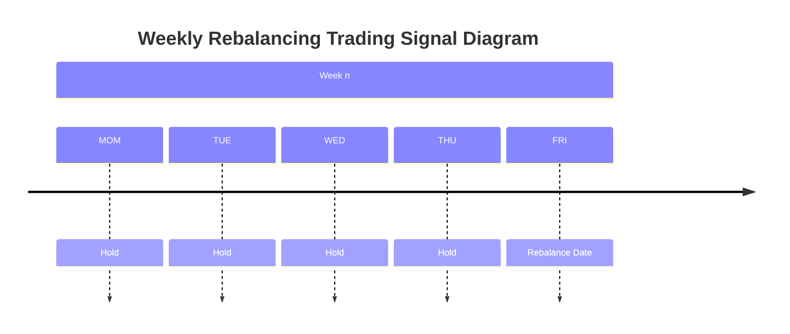

## Config Explained in Details

### Sell Rule

The diagram below depicts the trade behaviour for `date-rule: W-THU`.

For this example, the behaviour of `sell-rule` varies slightly across different backtesting engines. This is summarized as below:

<table style="border-collapse: collapse; width: 100%; max-width: 800px; margin: 20px auto; table-layout: fixed;">
    <tr>
        <td style="border: 1px solid black; padding: 10px; background-color: #f0f0f0; width: 25%;"></td>
        <th style="border: 1px solid black; padding: 10px; background-color: #e0e0e0; width: 37.5%;">current-bar</th>
        <th style="border: 1px solid black; padding: 10px; background-color: #e0e0e0; width: 37.5%;">next-bar</th>
    </tr>
    <tr>
        <th style="border: 1px solid black; padding: 10px; background-color: #e0e0e0;">Frozen</th>
        <td style="border: 1px solid black; padding: 10px;">
            ❌ Not supported
        </td>
        <td style="border: 1px solid black; padding: 10px;">
            • Sell on THU close 
            • Buy on FRI open
        </td>
    </tr>
    <tr>
        <th style="border: 1px solid black; padding: 10px; background-color: #e0e0e0;">Backtrader</th>
        <td style="border: 1px solid black; padding: 10px;">
            DEFAULT MODE 
            • Place sell/buy order on THU close 
            • Sell/Buy executed at FRI open
        </td>
        <td style="border: 1px solid black; padding: 10px;">
            CHEAT-ON-OPEN 
            • Place sell/buy order on FRI open 
            • Sell/Buy executed at FRI open
        </td>
    </tr>
    <tr>
        <th style="border: 1px solid black; padding: 10px; background-color: #e0e0e0;">Vectorbt</th>
        <td style="border: 1px solid black; padding: 10px;">
            • Sell on THU close 
            • Buy on THU close
        </td>
        <td style="border: 1px solid black; padding: 10px;">
            • Sell on FRI open 
            • Buy on FRI open
        </td>
    </tr>
</table>

